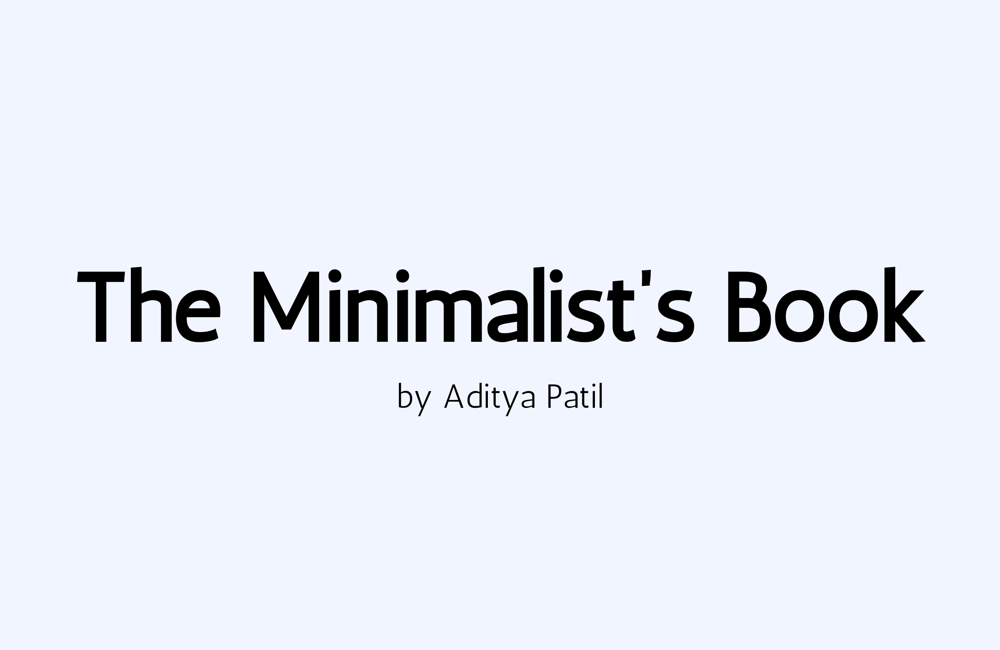

# The Minimalist's Book ✨ 

## What's this book about? 

The Minimalist's Book is a free and open-source platfrom for my articles about computers, electronics, philosophy and my thinkings. This place is mostly about passion for computers and electronics, focusing on security and the way I think about them. It's a geek's book, for people with curiosity about things reaching at a level where it becomes a lifestyle. 

You can find a lot of things here, especially if you are a Linux Power User and love low level computing. Whatever I study and understand from various resources, I write about them and publish here to spread the word. Or even some of my thinkings and way of life with my devices.

## What's the Minimalist Point? 

I read a lot of stuff on the internet and books. Apart from few, a lot of them focus on explaining things in an intentionally complex way. It's true that some of the things are hare hard to explain, but most of them are not. Here, I try to break down my explainations in **simple** and **minimal** way possible. I find that computers and electronics are not just topics, but a way of life and there are certian ideologies that I have to live a life of digital nomad. This is the place where I post freely, without any authority of publishers or control over the platform. 

## What are the topics you can expect? 

I write about lot of things. So I decided to divide my writings into parts, so that readers are comfortable while searching for the right content. For an general overview of my interests, I am listing a few topics down here which resonates with what the theme would be: 

**Technical Stuff:**
- Linux Operating Systems 
- Ricing Linux OS 
- Low-Level Computing 
- Rust and C Programming Language (and more)
- DevSecOps and Deployments 
- Linux Terminal and Customisation 
- Hacking Things (software + hardware)
- Binary Exploitation 
- Electronics and Mods 

**Thinkings:**
- Free Software and Freedom of Computing
- Suckless Philosophy
- Personal Opinions 
- Stoicism and Minimalism 
- Education 

## Site Details 

This site is completely owned by me as an individual. It has been developed with **Hugo** and **Digital Garden Theme**. I am keeping the source code open-source for any contributions that can be made from the community. You are welcome to fix any mistakes or typos in my writings, since I don't use any kind of fancy writing tools and everything is custom tailored. I am certainly not the best grammer expert, so your expertise would help make it better.

## License

The Minimalist's Book by Aditya Patil is licensed under <a href="https://creativecommons.org/licenses/by-nc/4.0/?ref=chooser-v1" target="_blank" rel="license noopener noreferrer" style="display:inline-block;">Creative Commons Attribution-NonCommercial 4.0 International</a>

